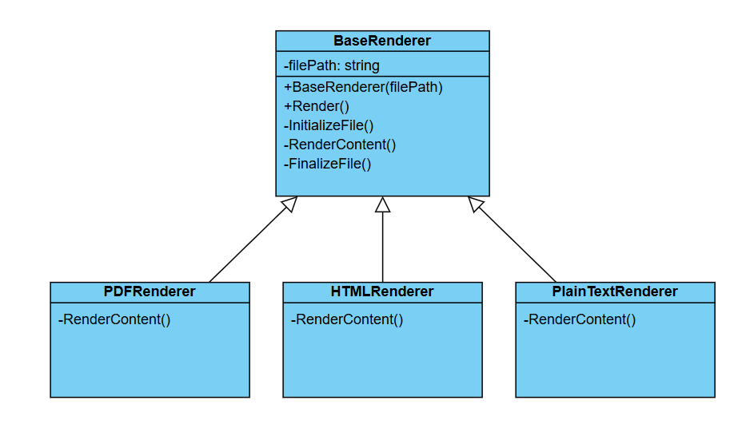

# Challenge: Document Rendering System
## Business Statement:
You are building a document rendering system that supports multiple document formats (e.g., PDF, HTML, Plain Text). Each format requires a different rendering process, but the overall structure of the rendering workflow is the same. For example:
1. **Initialize**: Prepare the document for rendering.
2. **Render Content**: Render the document content in the appropriate format.
3. **Finalize**: Clean up and finalize the rendered document.

## Requirements:
1. Document Formats:
	+ The system should support rendering documents in PDF, HTML, and Plain Text formats.
2. Rendering Workflow:
	+ The rendering process should follow a consistent structure (initialize, render content, finalize).
	+ Each document format should implement its own logic for rendering content.
3. Extensibility:
	+ The system should be designed in a way that makes it easy to add new document formats without modifying the existing code.

## My Class Diagram:

