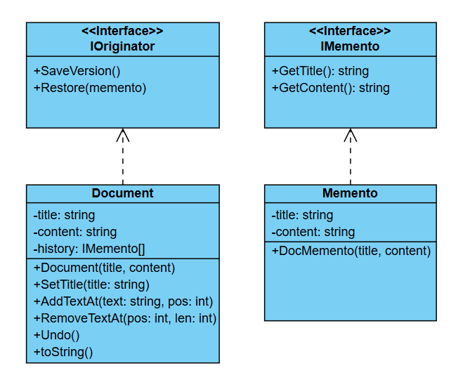

# Challenge: Document Versioning System
## Business Statement:
You are building a document editing system that allows users to create and edit documents. The system should support versioning, meaning users can save the current state of the document and restore it to a previous state if needed. For example:
+ A user edits a document and saves its state.
+ The user makes further changes but later decides to revert to the previously saved state.

## Requirements:
1. Document Class:
	+ Represents a document with properties like Content and Title.
	+ Provides methods for editing the document (e.g., AddText, RemoveText).
2. Versioning:
	+ The system should allow users to save the current state of the document.
	+ Users should be able to restore the document to a previously saved state.

## My Class Diagram:

