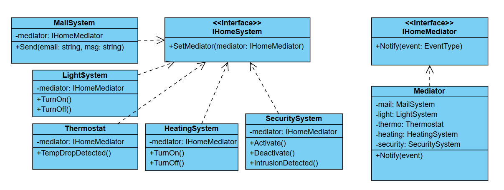

# Challenge: Smart Home Notification System
## Business Statement:
You are building a smart home system where various devices (e.g., lights, thermostat, security system) need to communicate with each other based on specific events. For example:
+ When the security system detects an intrusion, it should turn on the lights and send an alert to the homeowner.
+ When the thermostat detects a temperature drop, it should turn on the heating system.
+ When the lights are turned off, the security system should be activated.

## Requirements:
1. Device Communication:
	+ Devices should be able to send and receive notifications about events.
	+ Each device should act independently but respond to events from other devices.
2. Event Handling:
	+ When a device triggers an event (e.g., intrusion detected, temperature drop, lights turned off), other devices should react accordingly.
3. Extensibility:
	+ The system should be designed in a way that makes it easy to add new devices or modify the behavior of existing devices without tightly coupling them.

## My Class Diagram:

