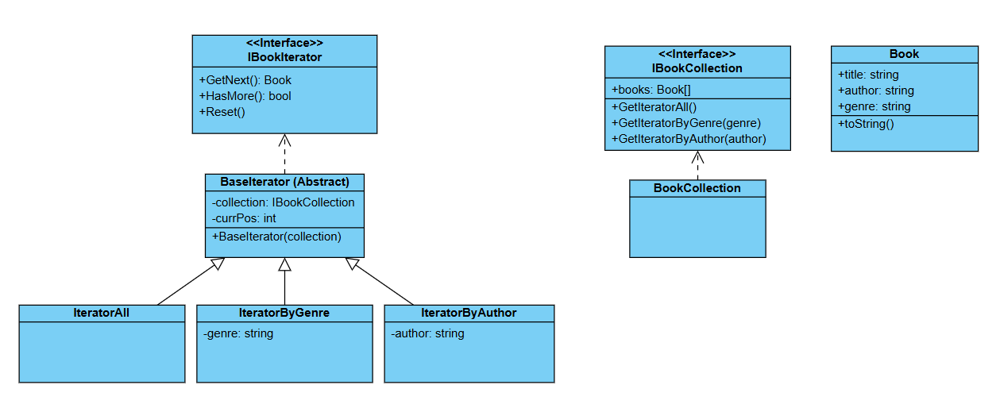

# Challenge: Library Catalog System
## Business Statement:
You are building a library catalog system that manages a collection of books. Each book has properties like `Title`, `Author`, and `Genre`. The system should allow users to:
+ Iterate over the collection of books in a structured way, such as:
	+ Listing all books.
	+ Listing books in a specific genre.
	+ Listing books by a specific author.

## Requirements:
1. Book Collection:
	+ The system should store a collection of books.
	+ Each book has properties: `Title`, `Author`, and `Genre`.
2. Iteration:
	+ The system should provide a way to iterate over the collection of books:
		+ **All Books**: Iterate over all books in the catalog.
		+ **By Genre**: Iterate over books in a specific genre.
		+ **By Author**: Iterate over books by a specific author.

## My Class Diagram:

