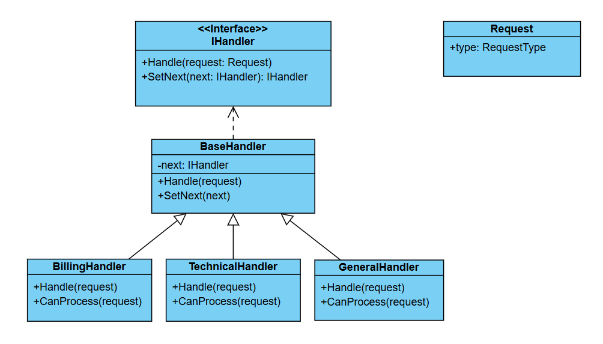

# Challenge: Request Handling System
## Business Statement:
You are building a system to handle customer support requests. Each request has a type (e.g., **Billing**, **Technical**, **General**) and a priority level (e.g., Low, Medium, High). The system should process requests by passing them through a series of handlers, where each handler can either process the request or pass it to the next handler in the chain.

## Requirements:
1. The system should have multiple handlers, each responsible for processing a specific type or priority level of request.
2. If a handler cannot process a request, it should pass the request to the next handler in the chain.
3. The system should demonstrate how requests are processed by the chain of handlers.

## My Class Diagram:

