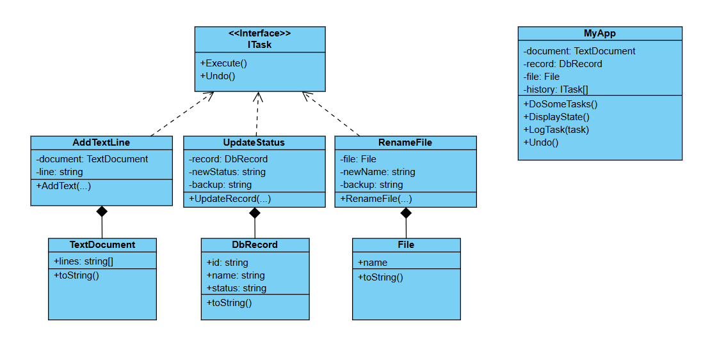

# Challenge: Task Scheduler System
## Business Statement:
You are building a task scheduler system that allows users to schedule and execute tasks. Each task is represented as an object, and the system should provide a way to execute, undo, and log tasks. The tasks should support operations that can be logically undone, such as modifying a document or updating a database.

## Requirements:
+ **Add Text to Document**: Adds a line of text to a document. The `Undo` operation removes the last added line.
+ **Update Database Record**: Updates a specific field in a database record. The `Undo` operation reverts the field to its previous value.
+ **Rename File**: Renames a file. The `Undo` operation reverts the file to its original name.

## My Class Diagram:

