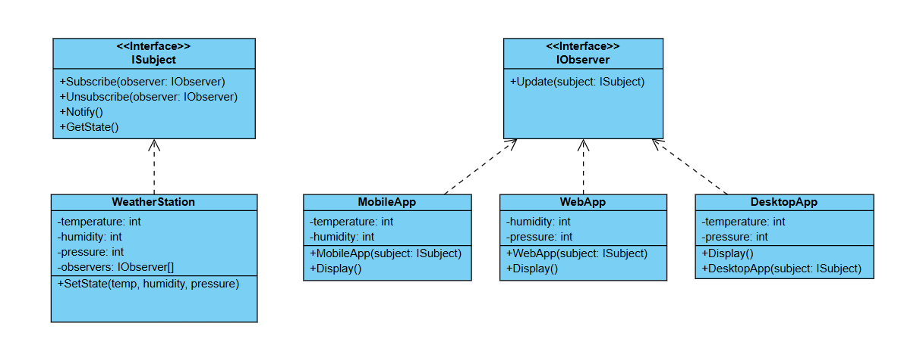

# Challenge: Weather Monitoring System
## Business Statement:
You are building a weather monitoring system that collects data from multiple weather stations (e.g., temperature, humidity, pressure). The system should notify various display devices (e.g., mobile app, web dashboard, desktop app) whenever the weather data changes. For example:
+ When the temperature changes, all display devices should be updated with the new value.
+ When the humidity changes, all display devices should be updated with the new value.

## Requirements:
1. Weather Data Collection:
	+ The system should collect weather data (e.g., temperature, humidity, pressure) from multiple weather stations.
2. Display Devices:
	+ The system should support multiple display devices (e.g., mobile app, web dashboard, desktop app) that show the current weather data.
3. Real-Time Updates:
	+ Whenever the weather data changes, all display devices should be notified and updated with the new values.
4. Extensibility:
	+ The system should be designed in a way that makes it easy to add new display devices or modify existing ones without tightly coupling them to the weather stations.

## My Class Diagram:

