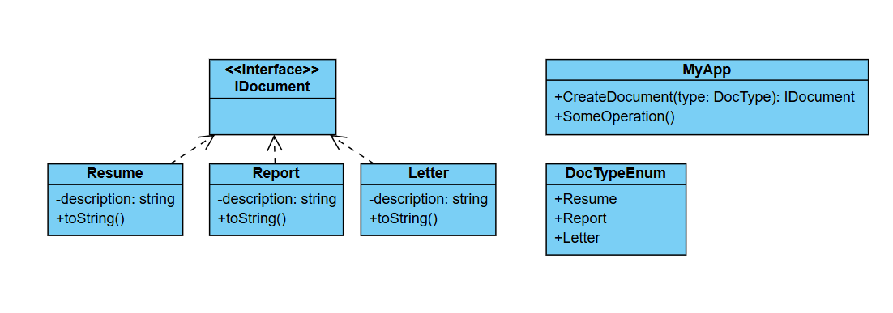

# Challenge: Document Generation System
## Business Statement:
You are building a console application for a document generation system. The system needs to create different types of documents (e.g., Resume, Report, Letter) based on user input. Each document type has a specific structure and content:
- A **Resume** typically includes sections like Personal Information, Education, Work Experience, and Skills.
- A **Report** includes sections like Title, Introduction, Body, Conclusion, and References.
- A **Letter** includes sections like Sender Address, Date, Recipient Address, Salutation, Body, and Closing.

The application should allow the user to select the type of document they want to create. Once the document type is selected, the system should generate the document with the appropriate structure and default content. The system should also allow for easy addition of new document types in the future without modifying the existing code.

## Requirements:
- The user should be able to select the type of document (e.g., Resume, Report, Letter).
- Based on the selected document type, the application should generate and display the document with the appropriate structure and default content.
- The system should be designed in a way that makes it easy to add new document types in the future without modifying existing code.

## My Class Diagram:

