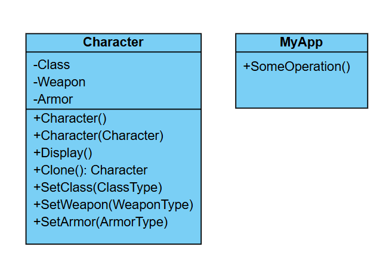

# Challenge: Game Character Clone System
## Business Statement:
You are building a console application for a game that allows players to create and customize characters. Each character has a set of attributes, such as:
- **Class**: Warrior, Mage, Archer.
- **Weapon**: Sword, Staff, Bow.
- **Armor**: Light, Medium, Heavy.

Players can create a base character with specific attributes and then clone it to create multiple characters with the same configuration. This is useful for creating squads or teams of characters with identical attributes. The system should also allow players to modify the cloned characters’ attributes without affecting the original character.

## Requirements:
- The player should be able to create a base character with specific attributes (Class, Weapon, Armor).
- The player should be able to clone the base character to create multiple characters with the same configuration.
- The cloned characters should be independent of the original character, meaning modifications to a cloned character should not affect the original character or other clones.
- The system should be designed in a way that makes it easy to add new attributes or character types in the future without modifying existing code.

## My Class Diagram:

