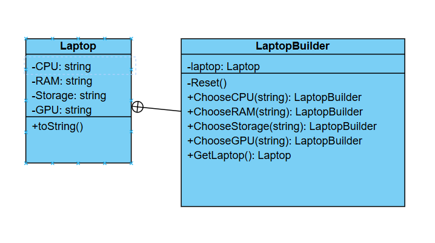

# Challenge: E-Commerce Product Customization
## Business Statement:
You are building a console application for an e-commerce platform that allows users to customize and order products. One of the products is a customizable laptop. Users can select various configurations for the laptop, such as:
- **Processor**: Intel i5, Intel i7, AMD Ryzen 5, AMD Ryzen 7.
- **RAM**: 8GB, 16GB, 32GB.
- **Storage**: 256GB SSD, 512GB SSD, 1TB SSD.
- **Graphics Card**: Integrated, NVIDIA GTX 1650, NVIDIA RTX 3060.

The application should allow users to select their desired configuration step-by-step and then create a fully configured laptop object. The system should ensure that the laptop object is immutable once created (i.e., its configuration cannot be changed after creation). Additionally, the system should be flexible enough to allow adding new configuration options in the future without modifying the existing code.

## Requirements:
- The user should be able to select the processor, RAM, storage, and graphics card step-by-step.
- Once the configuration is complete, the application should create a Laptop object with the selected configuration.
- The Laptop object should be immutable (i.e., its properties cannot be changed after creation).
- The system should be designed in a way that makes it easy to add new configuration options (e.g., a new type of processor or storage) without modifying the existing code.

## My Class Diagram:

