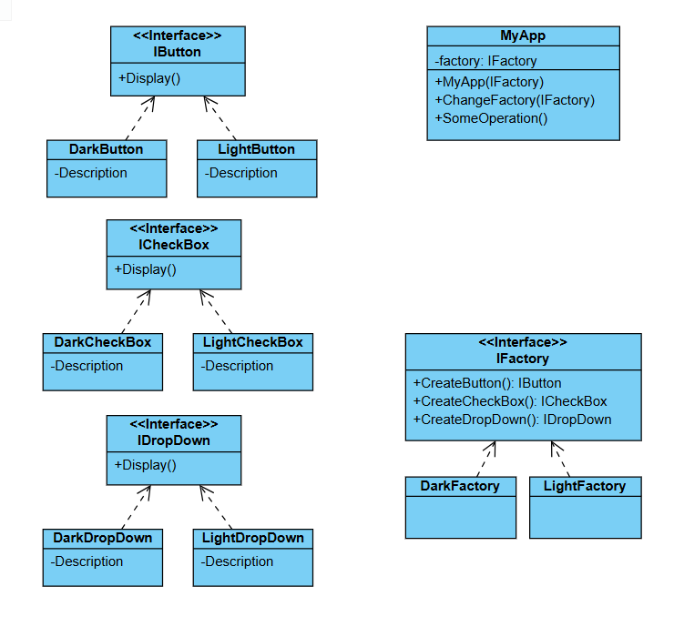

# Challenge: Dynamic UI Component Generator
## Business Statement:
You are building a console application for a UI framework that dynamically generates different types of UI components (e.g., buttons, textboxes, dropdowns) based on user preferences. The framework needs to support multiple themes (e.g., Light Theme, Dark Theme) where each theme has its own style for the components. For example:
- A **Light Theme** button might have a white background and black text.
- A **Dark Theme** button might have a black background and white text.

The application should allow the user to select a theme at runtime, and based on the selected theme, it should generate and display the corresponding UI components with the appropriate styles. The system should be easily extensible to add new themes or new types of UI components in the future.

## Requirements:
1. The user should be able to select a theme (e.g., Light or Dark).
2. Based on the selected theme, the application should generate and display a set of UI components (e.g., Button, TextBox, Dropdown) with the correct styles.
3. The code should be designed in a way that makes it easy to add new themes or new types of UI components without modifying existing code.

## My Class Diagram:

