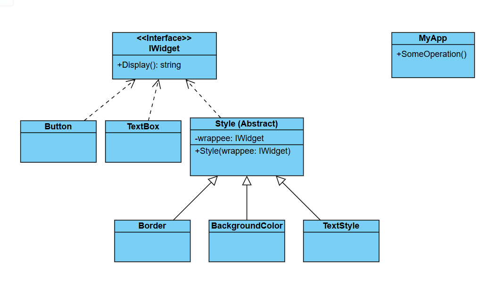

# Challenge: Dynamic UI Styling System
## Business Statement:
You are building a console application for a UI framework that allows developers to dynamically apply styles to UI components (e.g., buttons, textboxes, panels). Each UI component can have multiple styles applied to it, such as:
- **Border Style**: Adds a border around the component.
- **Background Color**: Changes the background color of the component.
- **Text Style**: Changes the font, size, or color of the text.

The system should allow developers to apply one or more styles to a UI component at runtime. Additionally, the system should be flexible enough to allow for new styles to be added in the future without modifying the existing code.

## Requirements:
- Each UI component should support the application of multiple styles at runtime.
- Styles should be composable, meaning that multiple styles can be applied to a single component.
- The system should allow for easy addition of new styles without modifying the existing code.
- The system should demonstrate how styles are applied to a UI component and how they affect its appearance.

## My Class Diagram:

