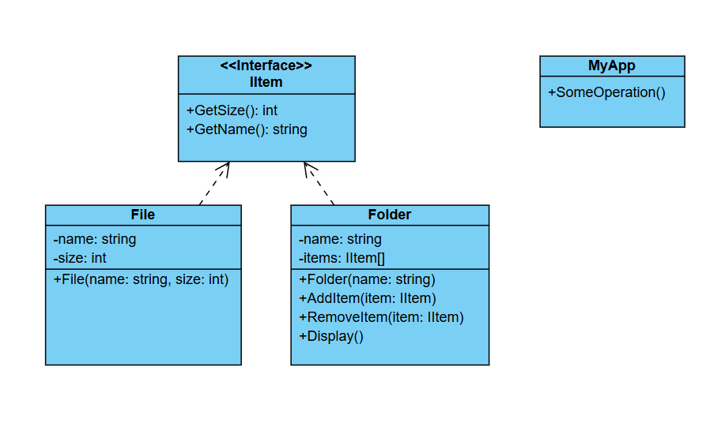

# Challenge: Hierarchical File System
## Business Statement:
You are building a console application to model a hierarchical file system. The file system consists of two types of entities:
- **Files**: These are the leaf nodes and represent individual files with a name and size.
- **Folders**: These are the composite nodes and can contain other files and folders. Each folder has a name and can have a variable number of child entities.

The application should allow users to perform operations on both files and folders, such as:
- Displaying the name and size of a file.
- Displaying the name and total size of a folder (including the size of all its contents).
- Adding or removing files and folders from a folder.

The system should treat files and folders uniformly, allowing operations to be performed on both without distinguishing between them at the higher level.

## Requirements:
- The system should support a hierarchical structure where folders can contain other folders and files.
- Operations like displaying the name and size should work uniformly on both files and folders.
- The system should allow for dynamic addition and removal of files and folders.
- The system should demonstrate how the hierarchical structure is traversed and how operations are performed on it.

## My Class Diagram:

