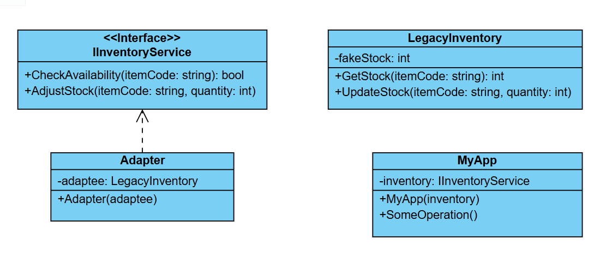

# Challenge: Legacy System Integration
## Business Statement:
You are working on a modern e-commerce application that needs to integrate with a legacy inventory management system. The legacy system has a class called `LegacyInventory` with the following interface:
- `GetStock(string itemCode)`: Returns the stock level for a given item code as an integer.
- `UpdateStock(string itemCode, int quantity)`: Updates the stock level for a given item code.

However, your modern e-commerce application expects an interface called `IInventoryService` with the following methods:
- `CheckAvailability(string itemCode)`: Returns a boolean indicating whether the item is in stock.
- `AdjustStock(string itemCode, int quantity)`: Adjusts the stock level for a given item code.

The legacy system cannot be modified, and you need to make it work with the modern application without changing the existing code of either system.

## Requirements:
- Create a solution that allows the modern e-commerce application to interact with the legacy inventory system.
- Ensure that the legacy system’s functionality is preserved while adhering to the modern application’s expected interface.
- The solution should be flexible enough to allow for future changes or replacements of the legacy system.

## My Class Diagram:

