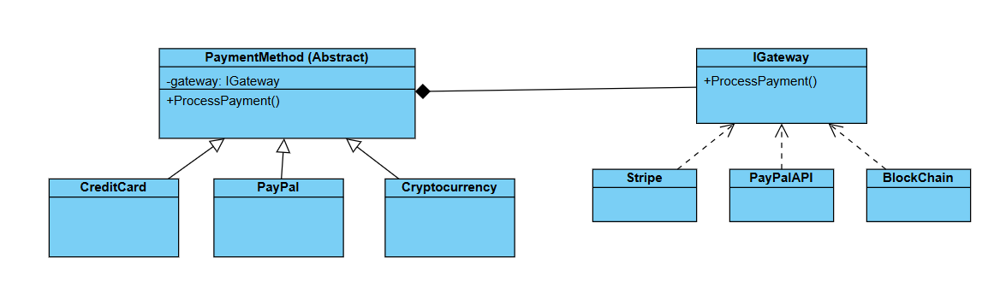

# Challenge: Payment Processing System
## Business Statement:
You are building a payment processing system for an e-commerce platform. The system needs to support multiple **payment methods** (e.g., Credit Card, PayPal, Cryptocurrency) and multiple **payment gateways** (e.g., Stripe, PayPal API, Blockchain). Each payment method can be processed through any payment gateway, and the system should allow you to add new payment methods or new payment gateways without modifying the existing code.

## Requirements:
- Payment Methods:
	+ Each payment method (e.g., Credit Card, PayPal, Cryptocurrency) has a method `ProcessPayment(amount: double)` that processes the payment.
	+ Payment methods can vary independently of the payment gateways.

## My Class Diagram:

