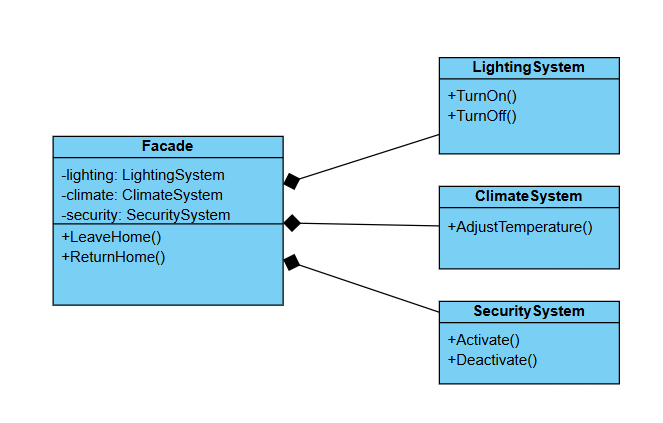

# Challenge: Smart Home Control System
## Business Statement:
You are building a system to control a smart home with multiple subsystems, such as **lighting**, **climate control**, and **security**. Each subsystem has its own complex set of operations, but users want to perform common tasks like `Leaving Home` and `Returning Home` with a single command.

## Requirements:
1. The system should provide a simplified interface for common tasks without exposing the complexity of the subsystems.
2. Users should be able to perform tasks like "Leaving Home" (turns off lights, adjusts thermostat, and activates security) and "Returning Home" (turns on lights, adjusts thermostat, and deactivates security) with a single method call.
3. The system should demonstrate how the simplified interface works without requiring users to interact with the subsystems directly.

## My Class Diagram:

