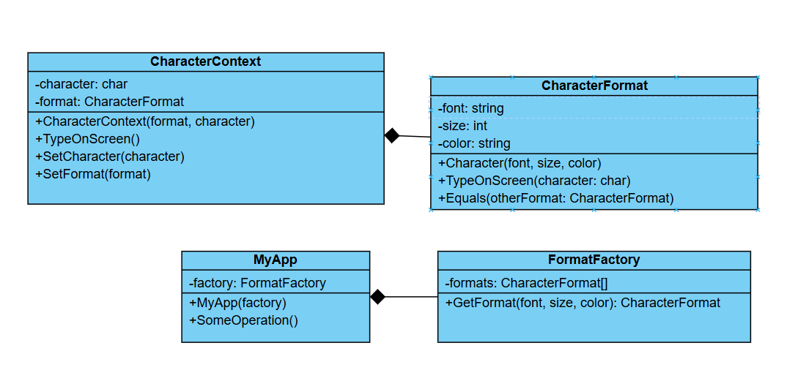

# Challenge: Text Formatting System
## Business Statement:
You are building a text formatting system for a document editor. Each character in the document can have its own formatting settings, such as **font**, **size**, and **color**. However, most characters share the same formatting settings, and storing these settings for each character individually would consume a lot of memory.

## Requirements:
1. The system should minimize memory usage by reusing shared formatting settings instead of storing them for each character.
2. Each character should store only its unique properties (e.g., **the character itself**) and a reference to the shared formatting settings.
3. The system should demonstrate how memory usage is reduced when rendering a large document with many characters.

## My Class Diagram:

